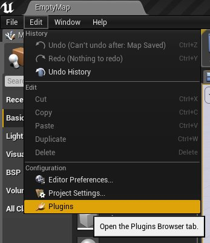
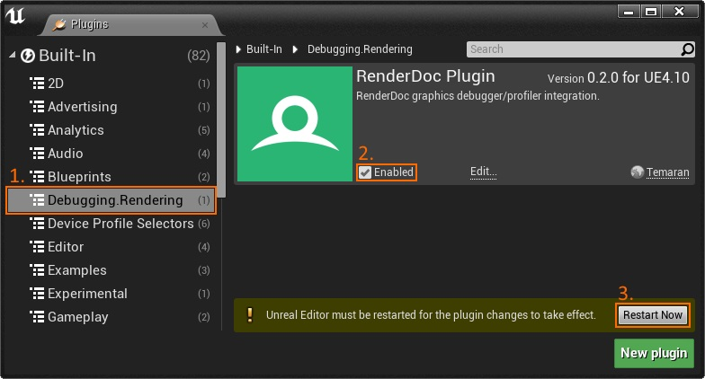
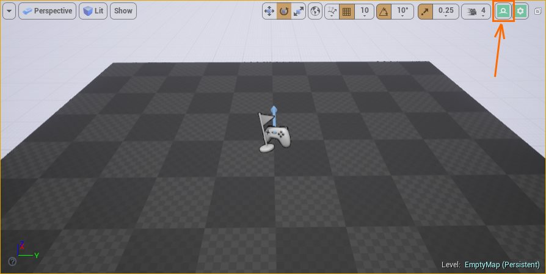
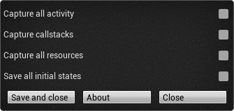

UE4RenderDocPlugin
==================

A plugin that adds easy access to Renderdoc inside Unreal Engine 4.  
Currently, this plugin only runs on Windows systems.

Shoutouts
----------

HUGE shoutout to Slomp for contributing a lot of amazing stuff to this project!
https://github.com/slomp

For BP Projects
---------------
I put a packaged plugin on my google drive if you cannot build from source:
https://drive.google.com/open?id=0Bz4Uwz2KHfw6VXpQRTliUXJFRTg

How to Use
----------

1. Make sure you are using Unreal Engine 4 version **4.10.0 or later**.  
   There are commit tags in the repository for older versions of the plugin that suit former versions of UE4.

2. Copy the contents of this repository into your `<Game>/Plugins/` folder.  
   Alternatively, you may copy it to the `UE4/Engine/Plugins/` folder, thus making the plugin available to all of your projects.

3. In order to build the plugin, make sure to run UE4's `Generate Project Files` to register the plugin source code with Unreal Build Tool.

4. Download and install RenderDoc from http://renderdoc.org/builds  
   The stable build v0.32 of 2016-12-02 is recommended.

5. From within the UE4 Editor, enable the RenderDocPlugin as shown below; you will need to restart the UE4 Editor for this change to take place.  
    | 

6. The first time the plugin is executed, it will attempt to automatically find a RenderDoc installation.  
   If unable to locate one, you will be prompted to locate RenderDoc manually through a dialog window.  
   The plugin will remember the RenderDoc location until it is no longer valid.

7. After the plugin has been loaded successfully, you should have two new buttons in the top-right corner of your Level Editor viewport.  
The left-most button  will capture the next frame and automatically launch RenderDoc to inspect the frame, while the right-most button  exposes some configuration options.  
Alternatively, the console command `RenderDoc.CaptureFrame` can also be used for capturing a frame. This is particularly useful when in PIE (Play-in-Editor) mode or when in Game mode, as the Level Editor viewport UI is omitted during gameplay.  
     
   > **NOTE:** if RenderDoc has already been launched and remains open, newly captured frames will not be automatically opened for inspection, but will be enqueued instead; the user must then select in the RenderDoc application the frame capture intended for inspection.  

8. The configuration button  exposes a few settings that can be tweaked prior to capturing the frame:  

   * _Capture all activity_: by default, the plugin only intercepts the rendering activity of the viewport currently active; by checking this setting, all rendering activity of all Editor windows will be captured (such as the Editor UI itself and Material Editor/Thumbnail previews).
   * _Capture callstack_: captures the call stack when each rendering API call was issued.
   * _Capture all resources_: include all rendering resources of the rendering context in the capture, even those that have not been used/referenced during the frame capture.
   * _Save all initial states_: include the initial state of all rendering resources, even if this initial state is found unlikely to contribute to the final contents of the frame being captured (for example, the initial contents of the GBuffer resources may be stripped from the capture since the whole GBuffer is likely to be rewritten by the frame; this setting prevents such a capture heuristic from occurring).


For Advanced Users
------------------

* This version of the plugin relies upon a `renderdoc.dll` compatible with the RenderDoc v0.26 API.  
  Other RenderDoc builds that retain API compatibility with RenderDoc v0.26 should also work with this version of the plugin.

* The very first time the plugin runs, a valid RenderDoc installation will be inferred by inspecting the following Windows registry key:  
  `HKEY_LOCAL_MACHINE\SOFTWARE\Classes\RenderDoc.RDCCapture.1\DefaultIcon\`  
If RenderDoc can not be located in this registry key (perhaps because you wish to use a portable version of RenderDoc, or decided to build RenderDoc from source), you will be asked to locate `renderdocui.exe` manually through a dialog window.  
The plugin will then keep track of this RenderDoc location by adding an entry to the following UE4 configuration file:  
  `<Game>/Saved/Config/Windows/Game.ini`

* You may also explicitly direct the plugin to a RenderDoc location by editing the following configuration file  
  `Engine/Config/BaseGame.ini`  
  and adding the following entry to it:  
  ````ini
  [RenderDoc]
  BinaryPath=<path-to-your-RenderDoc-folder>
  GreetingHasBeenShown=True
  ````
  This method can be very useful if you wish to deploy RenderDoc into repositories that are shared by entire teams, as the RenderDoc path can be relative to some Game or Engine directory.

* You may force plugin compilation by setting the following in the `RenderDocPlugin.uplugin` file:
  ```json
  "EnabledByDefault" : true,
  ```
  Note that this will not only force-build the plugin, but will also keep the plugin activated at all times.  
  You can then selectively disable the plugin by inserting the following into your `<Game>.uproject` file:
  ```json
  {
    "Name": "RenderDocPlugin",
    "Enabled": false
  },
  ```

* It is possible to use the plugin in Standalone Game builds (i.e., builds without editor). Open `RenderDocPlugin.uplugin` and change the plugin `"Type"` from `"Developer"` to `"Runtime"`. This will enable the plugin code to be embedded into the game executable (that is, statically linked into the monolithic game binary image). **Note, however, that the plugin will be loaded even on shipping builds!**
